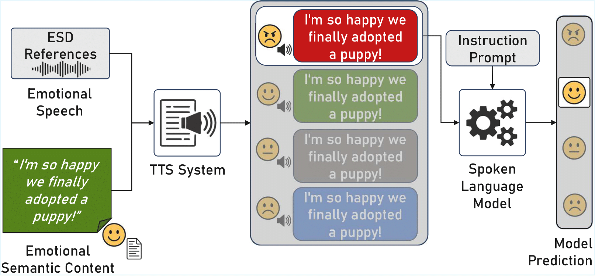

# Evaluating Emotion Recognition in Spoken Language Models on Emotionally Incongruent Speech

> Pedro Corrêa, João Lima, Victor Moreno, Lucas Ueda, Paula Costa

In this work, we evaluate four SLMs on the task of speech emotion recognition using a dataset of emotionally incongruent speech samples, a condition under which the semantic content of the spoken utterance conveys one emotion while speech expressiveness conveys another. Our results reveal that SLMs rely predominantly on textual semantics rather than speech emotion to perform the task, indicating that text-related representations largely dominate over acoustic representations. We release both the code and the Emotionally Incongruent Synthetic Speech dataset (EMIS) to the community.



## Usage

### Generating Speech Samples with each TTS system

Download the ESD dataset (https://github.com/HLTSingapore/Emotional-Speech-Data). We filtered this dataset for English speakers only. You can allocate the filtered version in ```/speech_generation/ESD_english/```.

Each folder inside ```/speech_generation/``` directs to instructions on how to run each speech generation process per TTS system.

### Evaluating the Spoken Language Models on Emotion Recognition

Download the EMIS dataset (https://ieee-dataport.org/documents/emotionally-incongruent-synthetic-speech-dataset-emis), or use other speech samples to evaluate each SLM. The default path for sample analysis is ```/SLM_eval/EMIS_dataset/```.

Each folder inside ```/SLM_eval/``` directly opens up a fork for all evaluated SLMs repositories, all containing individual ```README.md```, ```environment.yml```, ```requirements.txt``` and added/modified scripts from each original repository.

### Extracting Results from SLMs' Outputs

In the ```ser``` folder, you will find information on how to extract and consolidate results from each SLM output.

## Citation

Consider citing this paper if you find our work useful:

```
TBD
```
